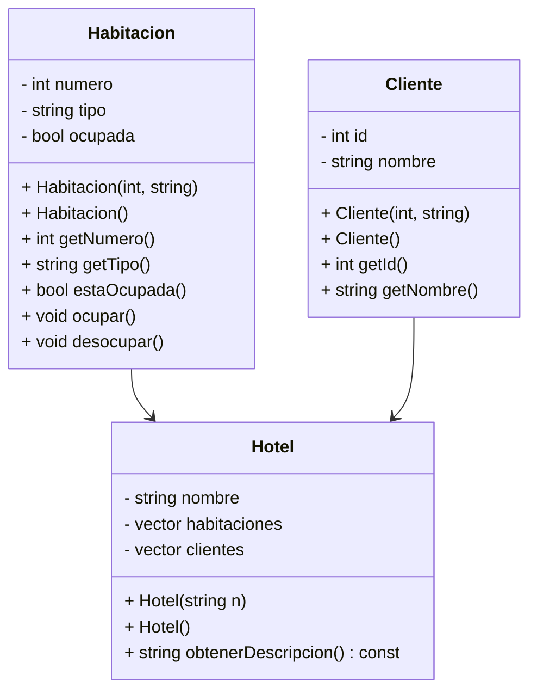
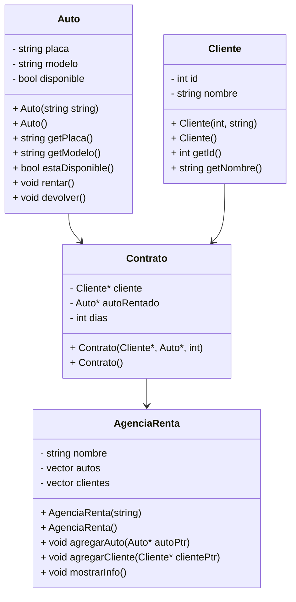

```mermaid
classDiagram
    class Habitacion {
        - int numero
        - string tipo
        - bool ocupada
        + Habitacion (int, string)
        + Habitacion ()
        + int getNumero ()
        + string getTipo ()
        + bool estaOcupada ()
        + void ocupar ()
        + void desocupar ()
    }

    class Cliente {
        - int id
        - string nombre
        + Cliente (int, string)
        + Cliente ()
        + int getId ()
        + string getNombre ()
    }

    class Hotel {
        - string nombre
        - vector <Habitacion> habitaciones
        - vector <Cliente*> clientes
        + Hotel (string n)
        + Hotel ()
        + string obtenerDescripcion() const
    }

    Habitacion --> Hotel
    Cliente --> Hotel
```

```mermaid
classDiagram
    class Auto {
        - string placa
        - string modelo
        - bool disponible
        + Auto(string string)
        + Auto ()
        + string getPlaca ()
        + string getModelo ()
        + bool estaDisponible ()
        + void rentar ()
        + void devolver ()
    }

    class Cliente {
        - int id
        - string nombre
        + Cliente (int, string)
        + Cliente ()
        + int getId ()
        + string getNombre ()
    }

    class Contrato {
        - Cliente* cliente
        - Auto* autoRentado
        - int dias
        + Contrato (Cliente*, Auto*, int)
        + Contrato ()
    }
    class AgenciaRenta {
        - string nombre
        - vector <Auto*> autos
        - vector <Cliente*> clientes
        + AgenciaRenta(string)
        + AgenciaRenta ()
        + void agregarAuto(Auto* autoPtr)
        + void agregarCliente( Cliente* clientePtr)
        + void mostrarInfo()
    }


    Auto --> Contrato
    Cliente --> Contrato
    Contrato --> AgenciaRenta
```

